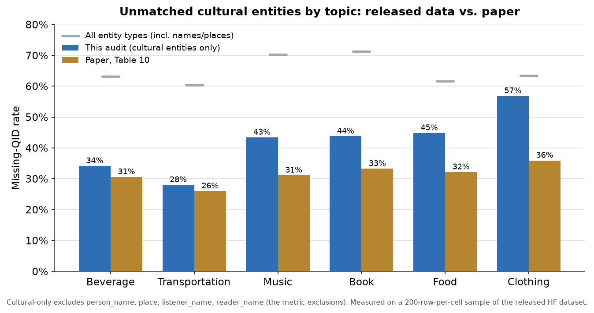
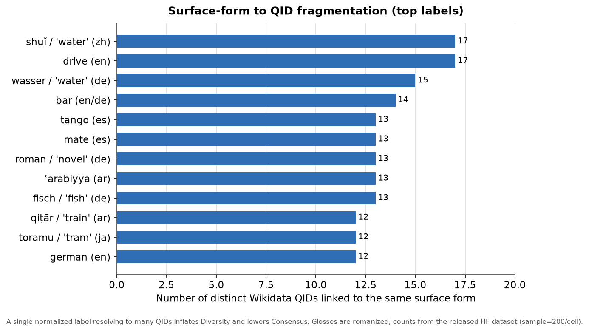
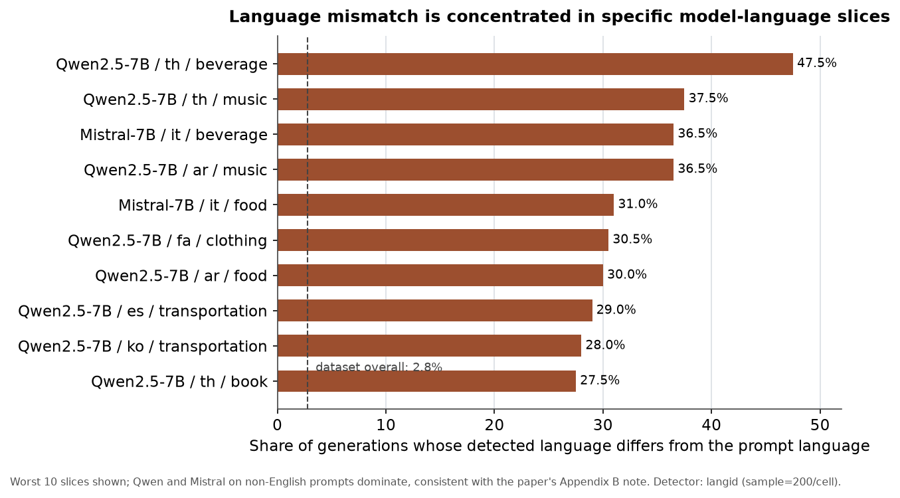

# Reproducibility and Data-Quality Audit — Results

This document summarizes what the reproducibility branch adds on top of the public
MAKIEval snapshot, and the findings from running the new tooling against the released
Hugging Face dataset (`Raoyuan/MAKIEval`).

Scope note: the public code is an earlier snapshot than the authors' working version, and
it is not confirmed whether the released dataset matches the exact version used for the
paper. Numbers below are measured on a 200-row-per-cell sample of the released dataset
(`--sample 200 --seed 42`) unless stated otherwise, and are reported descriptively rather
than as corrections to the paper.

## What was added

- A runnable implementation of the four paper metrics (granularity, diversity, culture
  specificity, culture consensus) computed directly from the released dataset, with unit
  tests and a Figure 2 reproduction test.
- A fidelity check (`validate_fidelity.py`) that re-derives selected paper observations
  from the released data.
- A published-data quality audit (`quality_report.py`).
- An end-to-end smoke reproduction over the Together API (`smoke_generation.py` plus
  `compare_to_published.py`).
- Repository hygiene: environment-based API keys, `requirements.txt`, license, and README
  reproduction instructions.

## Metric layer and fidelity check

The metrics follow the paper definitions (Eq. 1 for granularity; unique-QID counting for
diversity; target-country share for culture specificity; Jaccard over QID sets for culture
consensus), and exclude `place`, `person_name`, `listener_name`, and `reader_name` from
metric computation. Unit tests pin the Figure 2 English and German columns
(diversity 2 and 3; granularity 1.0; specificity 1.0 and 0.667). The Figure 2 consensus
value of 0.5 could not be derived from the entity attributions printed in the figure
(the stated sets give a Jaccard of 0.25), so that single case is recorded as an expected
failure rather than forced to pass.

The fidelity check reproduces the qualitative mode-collapse finding from Section 6.2:
for DeepSeek on English book prompts about the United States, one title dominates 99.7%
of generations in the released data. The exact diversity integer differs from the paper's
"close to 1" because diversity is a set-cardinality count and the released slice contains
a few additional rare titles; this is reported as a divergence rather than reconciled by
changing the metric.

## Published-data quality audit

### Unmatched cultural entities by topic

After restricting to cultural entity types (the same exclusions the metrics use), the
missing-QID rate is close to the paper's Table 10 for some topics (beverage, transportation)
and higher for others (clothing, book, food, music). Counting all entity types — including
person names and places, which carry no QID by design — roughly doubles the rate, which is
why the all-types number is reported only as a completeness diagnostic.



### Surface-form to QID fragmentation

The same normalized surface form is frequently linked to many different QIDs (for example,
the word for "water" in Chinese and German each map to 15–17 distinct QIDs). This
fragmentation inflates diversity and depresses consensus, and is a useful target for the
linking step.



### Language mismatch

Overall, 2.8% of generations are in a language other than the prompt language, but this is
concentrated in specific model-language slices — chiefly Qwen and Mistral on non-English
prompts — which is consistent with the behavior the paper describes in Appendix B.



Other observations: 5.16% of rows have an empty entity list, and rule-based checks flag a
small fraction of degenerate generations (repeated character or sentence loops); examples
are included in `DATA_QUALITY_REPORT.md`.

## End-to-end smoke reproduction

A small reproduction was run through the Together API to confirm the pipeline runs end to
end (prompt → generation → extraction → linking → metrics). This is a pipeline-integrity
check, not a faithful reproduction: it used the Together `Qwen2.5-7B-Instruct-Turbo`
serving endpoint rather than local paper weights, replaced the paper's GPT-4o-mini
extraction with a Together proxy model (no `OPENAI_API_KEY` was used), and generated only a
few responses per cell. The comparison in `REPRODUCTION_COMPARISON.md` is therefore
directional only; diversity and consensus are sample-size sensitive at this scale.

## Caveats

- Quality numbers use a 200-row-per-cell sample; pass `--full` to scan all rows.
- The released dataset may be an earlier snapshot than the paper run; the missing-QID gap
  for some topics may reflect that rather than a measurement difference. This is an open
  question for the authors.
- Live Wikidata SPARQL was rate-limited during the smoke run, which limited origin-based
  specificity in that path.

## Regenerating

```
python code/quality_report.py --full --seed 42       # refresh DATA_QUALITY_REPORT.md
python scripts/make_figures.py                        # refresh docs/figures/*.png
```
